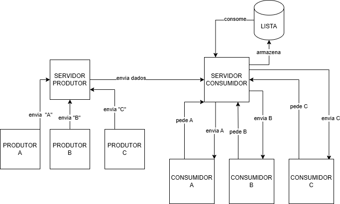

# Sistema Produtor-Consumidor com Sockets

Este projeto é uma simulação de um sistema de fila de mensagens baseado na arquitetura **Produtor-Consumidor**, implementado inteiramente em Python utilizando comunicação via `sockets` TCP e `threading` para execução concorrente.

## Arquitetura do Sistema



O sistema é dividido em quatro componentes principais, onde os servidores atuam como intermediários (brokers) entre quem produz os itens e quem os consome.

1. **Produtor (`produtor.py`)**
   - Gera produtos de um tipo específico (`A`, `B` ou `C`) e os envia continuamente pela rede.
   - Conecta-se ao `servidor_produtor.py` (127.0.0.1:8000).

2. **Servidor de Produção (`servidor_produtor.py`)**
   - Recebe as mensagens dos múltiplos produtores.
   - Organiza temporariamente em sua própria fila e repassa imediatamente ao estoque centralizado (Servidor Consumidor).
   - Utiliza threads independentes para escutar produtores e enviar ao servidor seguinte.

3. **Servidor de Consumo/Estoque (`servidor_consumidor.py`)**
   - Mantém o estoque final organizado nas categorias `Lista A`, `Lista B` e `Lista C`.
   - Escuta em (127.0.0.2:8000).
   - Aceita o depósito das mercadorias enviadas pelo Servidor de Produção.
   - Atende aos pedidos de consumo vindos dos clientes Consumidores. Se não houver produto no estoque, a requisição aguarda até que chegue.

4. **Consumidor (`consumidor.py`)**
   - Conecta-se ao `servidor_consumidor.py` pedindo produtos de uma lista específica.
   - Caso haja estoque disponível, recebe o item e volta a processar.

---

## Como Executar

Para ver a simulação em funcionamento em todo o seu potencial, você deve abrir **vários terminais** e iniciar os componentes na seguinte ordem:

### 1. Inicie o Servidor de Consumo (Estoque Central)
Este servidor deve ser o primeiro a subir, pois o servidor produtor precisará se conectar a ele.
```bash
python servidor_consumidor.py
```

### 2. Inicie o Servidor de Produção
```bash
python servidor_produtor.py
```

### 3. Inicie os Consumidores
Você pode iniciar vários terminais de consumidores. Passe a letra da fila (`a`, `b` ou `c`) como argumento:
```bash
# Consumindo itens "A"
python consumidor.py a

# Consumindo itens "B"
python consumidor.py b
```

### 4. Inicie os Produtores
Em outros terminais, inicie a produção dos itens informando a letra do produto:
```bash
# Produzindo itens "A"
python produtor.py a

# Produzindo itens "B"
python produtor.py b
```

---

## Funcionamento Visual e Monitoramento

Todo o sistema foi projetado com logs de acompanhamento em tela para facilitar a depuração e o entendimento do fluxo da rede. Ao rodar os servidores e clientes, você verá em tempo real:
- Notificações de clientes se conectando e desconectando.
- O tamanho atualizado das listas de fila no Servidor Produtor.
- O percurso visual em tempo real: O pacote saindo da Fábrica, sendo repassado por Transferência, armazenado no Estoque Central e, finalmente, sacado para Entrega ao Consumidor.

## Requisitos
- **Python 3.x**
- Nenhuma dependência externa ou biblioteca adicional é necessária (utiliza bibliotecas padrão `socket`, `threading`, `time`, `random` e `sys`).
